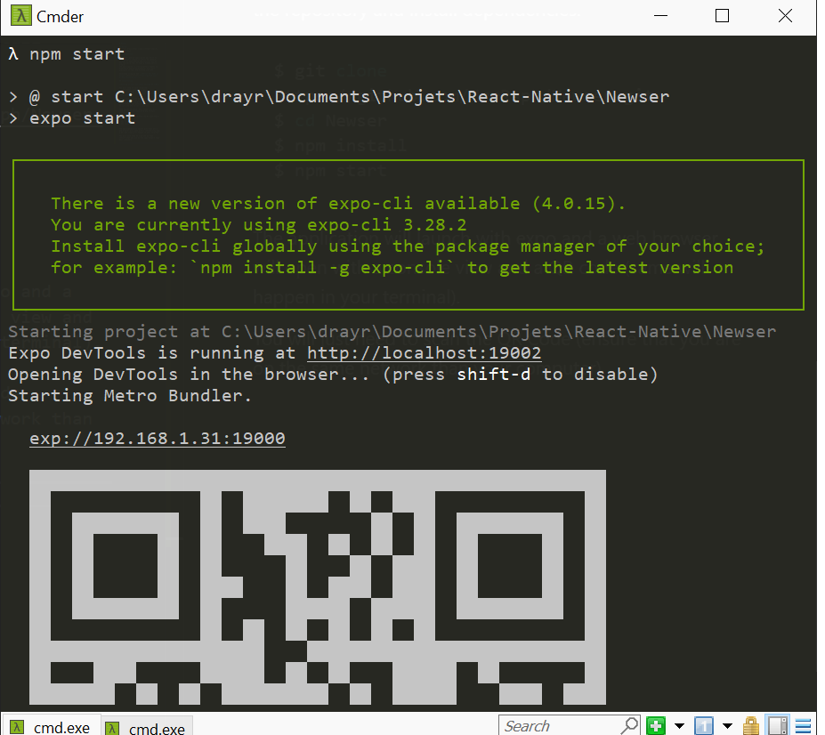
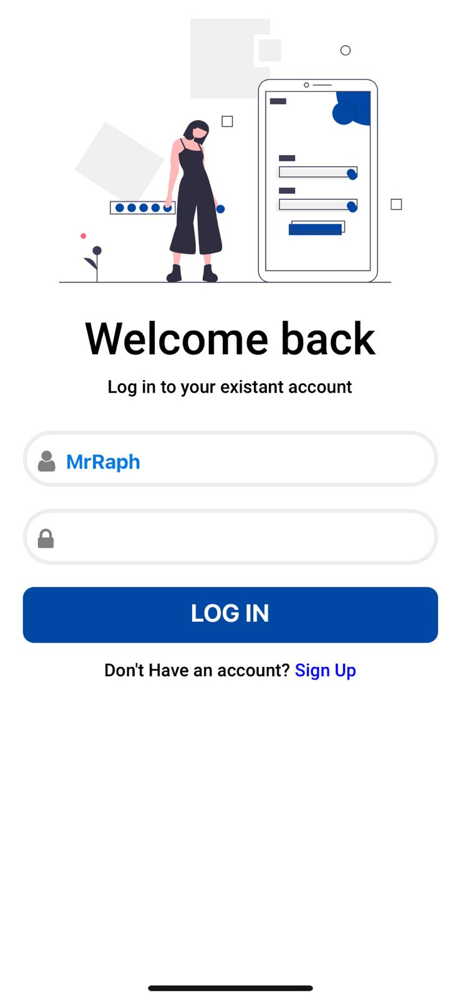
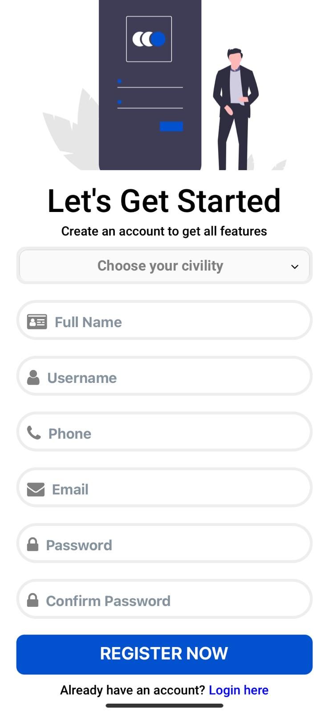
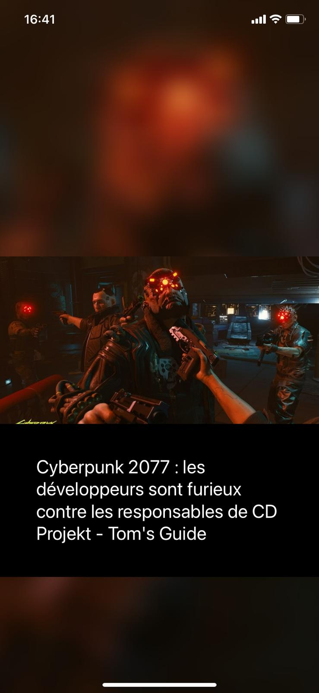
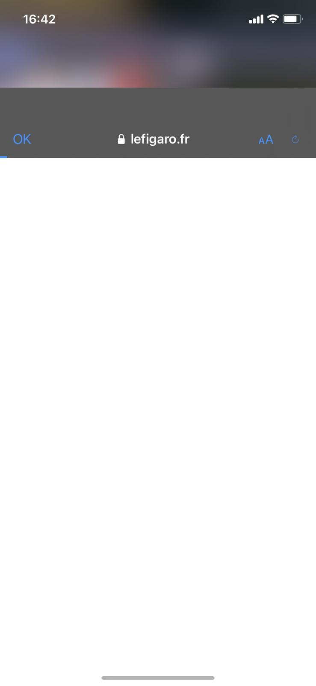

# Newser 

## Author
[Raphael Dray](https://www.linkedin.com/in/raphaeldray/)

## Introduction

The Newser mobile application was built to allow newsers (Newser's users) to connect through an application and quickly look at the top daily news through a bumped native browser.
The application is cross-platform thanks to Expo/React-Native development, thus it's available on IOS, Android and even Web.

Developed using my own __RESTful API Node.js Server, [NewserServer](https://github.com/MrrRaph/NewserServer/)__.

---

## Installation

__Running on your own phone through QR Code__.

You will need to have installed:
- [NPM](https://www.npmjs.com/)
- [Node.js](https://nodejs.org/fr/)
- [Expo.js](https://docs.expo.io/get-started/installation/)

Before launching the application, please refer to the [README of the API Server](https://github.com/MrrRaph/NewserServer/blob/master/README.md) mentionned previously and be sure the API Server is started.

Then following those requirements you will need to clone the repository and install dependencies:
```bash
$ git clone https://github.com/MrrRaph/Newser.git
$ cd Newser
$ npm install
$ npm start
```

The application will launch with expo and a web browser will open with a console view and a QR code (same will happen in your terminal).

You will just need to scan the QR Code (ensure that you are on the same network than your computer).

<p align="center" width="100%">
    
</p>

---

## Features

The project includes the use of several technical features and methods;
- [React-Native Async Storage]()
- [React-Native Navigation]()
- [Expo]()
- [Fetchival]()
- [Lodash (_)]()
- [Lottie]()
- [NewsAPI]()
- [React-Native DropDown Picker]()
- [React-Native Elements]()
- [React-Native Keyboard Aware ScrollView]()
- [React-Native Swiper]()
- [React-Native Vector Icons]()
- [Redux]()
- [Babel.js]()

---

## Implementations

Several features have been implemented in this application.

__Components__
- CivilityDropDown
- Inputs
- Submit

__Screens__
- Home
- Login
- Register
- Splash

__Services__
- API
- Persist
- RouteHistory
- Session

__Navigator__
- Stack Navigator

---

## How the mobile app works ?

### Login Screen

When launching the application, the login screen is displayed right after the Splash Screen on loading of the fonts used in the application.
You can connect and access to your daily news.
If you do not have account, you can register and create an account.

<p align="center" width="100%">
    
</p>

---

### Register Screen

There is the register screen, you could create your account in.

<p align="center" width="100%">
    
</p>

---

### Home Screen

Now, we can access the home screen of the application.

We can see the top headlines navigating through a swiper and looking further by tapping on a news which suggest our interest.

<p align="center" width="100%">
    
</p>

By tapping on a news a native web browser bump over the application.

<p align="center" width="100%">
    
</p>

---

## Improvements

We could improve the API Server by adding /post/ route to improve the mobile app. Thus, we could react to a news inside the application

We could improve the design and add new functionnalites since the architecture is quite maintenable.